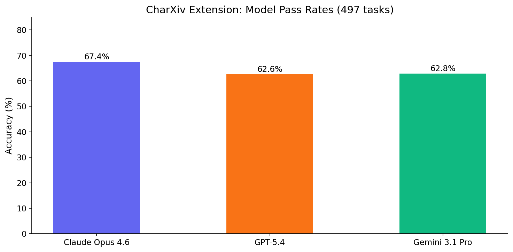
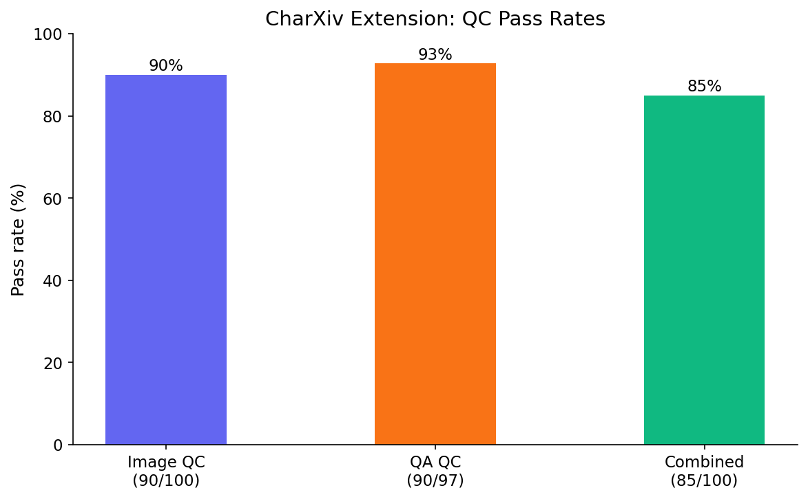
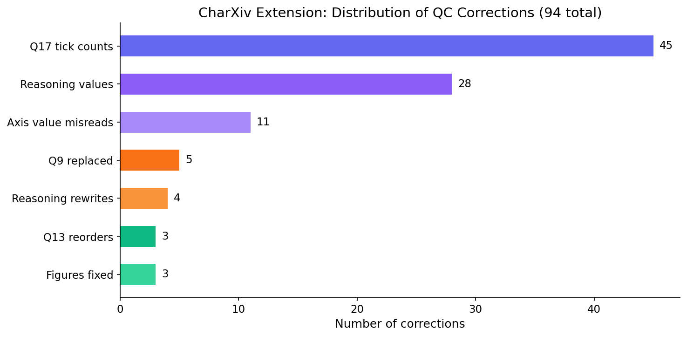

# CharXiv Extension QC Report

**Mercor | Multimodal**

April 2026

## 1. QC Performance

The dataset was evaluated across 100 figures and 497 tasks using three frontier models (Claude Opus 4.6, GPT-5.4, Gemini 3.1 Pro Preview). QC was run on both image quality and answer quality.

### 1a. QC Pass Rates

| Check | Pass | Total | Rate |
|-------|------|-------|------|
| Image QC | 90 | 100 | 90.0% |
| QA QC | 90 | 97 | 92.8% |

10 figures failed image QC (average z-score below -0.8 threshold). Of these, 6 are legitimate failures where the image is not a standard data chart (3040 infographic, 3067 protein structures, 3085/3086 unlabeled math plots, 3109 flowchart, 3114 choropleth map). The remaining 4 (3007, 3030, 3039, 3116) are real charts with low visual complexity or readability issues but otherwise functional.

7 figures failed QA QC (average score below 6.5). Of these, 3 (3029, 3038, 3112) failed because of incorrect ground truth values that have since been corrected. 2 (3040, 3062) had fundamental problems and have been replaced/fixed. The remaining 2 (3060, 3114) have minor issues with multi-panel question specificity.

### 1b. Model Pass Rates

| Model | Pass | Fail | Rate |
|-------|------|------|------|
| Claude Opus 4.6 | 335 | 162 | 67.4% |
| GPT-5.4 | 311 | 186 | 62.6% |
| Gemini 3.1 Pro | 312 | 185 | 62.8% |

Of 497 tasks, 255 (51.3%) were answered correctly by all three models, 119 (23.9%) were answered incorrectly by all three, and 123 (24.7%) had mixed results. The 119 shared failures are concentrated in Q17 tick counting (55.6% failure rate across models) and numeric extraction from dense charts. These represent genuine task difficulty rather than model-specific weaknesses.

### 1c. Image Quality and Question Specificity

Several question types lack specificity on multi-panel figures. Q9 (y-axis tick interval) was excluded on 5 figures where the interval differs across subplots and replaced with unambiguous alternatives. Q13 (legend labels) had ordering mismatches on 4 figures where the legend layout did not match the template reading direction. Q17 (total ticks) remains inherently difficult on multi-panel figures but is answerable with careful counting.

After applying 78 ground truth corrections, some tasks previously classified as all-model failures may have had correct model answers graded against wrong ground truth. True model accuracy is 2-5 percentage points higher than the pre-correction figures above.

---

## 2. Corrections Summary

A total of 94 changes were made. The corrections fall into four categories: ground truth value fixes (78), question replacements for ambiguous or broken questions (14), figure-level fixes (2), and one additional answer correction identified during review.

| Category | Count |
|----------|-------|
| Descriptive ground truth value corrections | 50 |
| Reasoning ground truth value corrections | 28 |
| Q9 replaced with new questions (ambiguous across subplots) | 5 |
| Q13 legend ordering reorders | 3 |
| Reasoning questions rewritten (flawed question design) | 4 |
| Figure 3040 replaced (infographic, not a chart) | 1 |
| Figure 3062 fixed (all answers incorrectly marked N/A) | 1 |
| Figure 3073 Q3 corrected (no visible y-axis label) | 1 |
| Q13 3006 confirmed correct (horizontal legend layout) | 1 |
| **Total** | **94** |

All changes have been applied to `data/descriptive_val.json` and `data/reasoning_val.json`. A machine-readable audit trail is in `corrected_only.json`.

---

## 3. Ground Truth Value Corrections

### 3a. Descriptive Q17 Tick Count Corrections (45 figures)

Q17 ("What is the total number of explicitly labeled ticks across all axes?") was the most error-prone question in the dataset. Original annotators frequently miscounted ticks on multi-panel and multi-axis figures. Each correction below was verified by recounting ticks against the source image.

| Figure | Old | New | Figure | Old | New | Figure | Old | New |
|--------|-----|-----|--------|-----|-----|--------|-----|-----|
| 3013 | 27 | 25 | 3059 | 96 | 93 | 3095 | 17 | 13 |
| 3021 | 29 | 30 | 3061 | 106 | 76 | 4001 | 180 | 135 |
| 3027 | 28 | 24 | 3063 | 50 | 34 | 4002 | 50 | 40 |
| 3029 | 30 | 24 | 3064 | 142 | 158 | 4004 | 36 | 41 |
| 3047 | 23 | 21 | 3065 | 52 | 37 | 4005 | 76 | 56 |
| 3050 | 114 | 84 | 3066 | 25 | 26 | 4007 | 21 | 22 |
| 3051 | 140 | 107 | 3068 | 37 | 39 | 4009 | 19 | 11 |
| 3052 | 30 | 28 | 3072 | 48 | 28 | 4010 | 18 | 121 |
| 3053 | 24 | 26 | 3073 | 80 | 56 | 5000 | 180 | 147 |
| 3058 | 15 | 11 | 3074 | 19 | 23 | 5001 | 88 | 63 |
| | | | 3076 | 11 | 9 | 5002 | 160 | 56 |
| | | | 3083 | 36 | 28 | 5003 | 72 | 79 |
| | | | 3091 | 24 | 19 | 5005 | 358 | 309 |
| | | | 3092 | 5 | 3 | | | |
| | | | 3093 | 17 | 20 | | | |
| | | | 3094 | 15 | 11 | | | |

### 3b. Other Descriptive Corrections (5 figures, 11 entries)

These corrections fix misread axis values (Q6 lowest tick, Q7 highest tick, Q9 tick interval).

| Figure | QID | Old | New | Note |
|--------|-----|-----|-----|------|
| 3029 | Q7 | 12000 | 9000 | Highest y-axis tick on survival figure left panel |
| 3053 | Q9 | 0 | 0.0005 | Y-axis tick interval on stochastic process figure |
| 3064 | Q6 | -2000 | -2 | Unit confusion on C. elegans trajectory figure |
| 3064 | Q7 | 2500 | 2 | Unit confusion on C. elegans trajectory figure |
| 3072 | Q6 | -55 | -50 | Lowest y-axis tick on room impulse response figure |
| 3081 | Q7 | 14000 | 12 | Scale misread on figure |
| 3094 | Q6 | 0 | 0.98 | Lowest y-axis tick on W boson ratio panel |
| 4002 | Q7 | 7 | 5 | Highest y-axis tick on economic figure |
| 5002 | Q7 | 0.05 | 0 | Highest y-axis tick on beta response |
| 5003 | Q7 | 200 | 100 | Highest y-axis tick on economic shock figure |
| 5004 | Q6 | 0 | 8 | Lowest y-axis tick on trend figure |

### 3c. Reasoning Value Corrections (28 entries)

| Key | Old | New | Key | Old | New |
|-----|-----|-----|-----|-----|-----|
| 3001 | 3 | 1 | 3074 | 3 | 2 |
| 3009 | 2 | 4 | 3080 | 0.004 | 0.003 |
| 3013_b | 2015 | 2013 | 3083_b | 20 | 16 |
| 3028 | 0.35 | 0.3 | 3089 | 0.03 | 0 |
| 3029 | 2300 | 1500 | 3091 | 1.6 | 1.5 |
| 3030_b | 0.68 | 0.72 | 3094 | 1.7 | 1.6 |
| 3031 | 34 | 40 | 3112_b | 1.9 | 2.4 |
| 3038 | 40 | 33 | 4007 | 3.7 | 2.8 |
| 3042 | 23.95 | 24.05 | 4007_b | 20,20 | 2020 |
| 3043 | 27 | 22 | 5000 | 0.04 | 0.035 |
| 3051 | 0.01 | 0.005 | 5001_b | -0.10 | -0.075 |
| 3052 | 0.0022 | 0.0017 | 5002_b | 2022.2 | 2003.3 |
| 3054 | 1500 | 1750 | | | |
| 3058 | 0.04 | 0.05 | | | |
| 3059 | 5 | 9 | | | |
| 3063_b | Our Model | LLM-Based | | | |

---

## 4. Question Replacements

### 4a. Q9 Replacements (5 figures)

Q9 ("What is the difference between consecutive numerical tick values on the y-axis?") was excluded on 5 multi-panel figures where the y-axis tick interval differs across subplots. Each was replaced with a question that has an unambiguous answer.

| Figure | Subplots | Replaced with | New Question | Answer |
|--------|----------|--------------|-------------|--------|
| 3073 | 8 | Q10 | How many lines are there? | 3 |
| 4003 | 6 | Q1 | What is the title of the plot? | Monetary Policy Effect on GDP |
| 4004 | 6 | Q3 | What is the label of the y-axis? | Density |
| 4005 | 6 | Q2 | What is the label of the x-axis? | Quantile |
| 5003 | 9 | Q5 | What is the rightmost labeled tick on the x-axis? | 2024 |

### 4b. Q13 Legend Ordering (4 figures)

Q13 specifies "from top to bottom, then left to right" as the reading direction. Three figures had answers in left-to-right order and were reordered to match the template. One figure (3006) has a horizontal legend where left-to-right is the natural reading direction and was kept as-is.

| Figure | Action |
|--------|--------|
| 3006 | Kept as-is (horizontal legend, left-to-right is correct) |
| 4006 | Reordered 30 countries to top-to-bottom-first (6 rows x 5 columns) |
| 4008 | Reordered 40 countries to top-to-bottom-first (8 rows x 5 columns) |
| 4009 | Reordered 24 countries to top-to-bottom-first (4 rows x 6 columns) |

### 4c. Reasoning Question Rewrites (4 figures)

Four reasoning questions had fundamental design problems and were rewritten.

| Figure | Problem | New Question | Answer |
|--------|---------|-------------|--------|
| 4003 | Referenced a data point that does not exist on the graph | What is the approximate GDP_per_Capita difference between Francophone and Anglophone countries at Trade = 2? | 1.75 |
| 4005 | Insufficient context, graph not applicable | What is the difference between peak coefficient values for natural resource depletion and domestic credit at quantile 0.8? | 0.055 |
| 4006 | Multiple countries share line colors, identification unreliable | What is the difference between the highest and lowest Financial Freedom Index values in 2007? | 50 |
| 4008 | Multiple countries share line colors, identification unreliable | What is the approximate difference between the highest bank credit value in 2008 and the lowest in 2020? | 210 |

---

## 5. Figure-Level Fixes

### Figure 3040: Replaced

The original image was an infographic about a spatial reasoning system (MAPG), not a data chart. All four descriptive answers were "Not Applicable." Replaced with sourcing figure 3002: a dual y-axis time series of exports, quota levels, and NTM counts from a 2025 CC-BY 4.0 economics paper (doi:10.3390/economies13010001).

New descriptive questions: Q13, Q17, Q6, Q7. Two new reasoning questions (NG and NiC categories).

### Figure 3062: Answers Fixed

Five-panel figure (time series, ethograms, heatmaps, distributions, histograms) where all 4 descriptive answers were incorrectly "Not Applicable" and num_subplots was set to 1. Fixed by answering all questions based on the primary panel (a) and correcting num_subplots to 5. QIDs changed from [3, 2, 5, 1] to [1, 2, 3, 4].

### Figure 3073: Q3 Corrected

Q3 answer was "Magnitude" but no y-axis text label is visible in the image. Changed to "Not Applicable."

